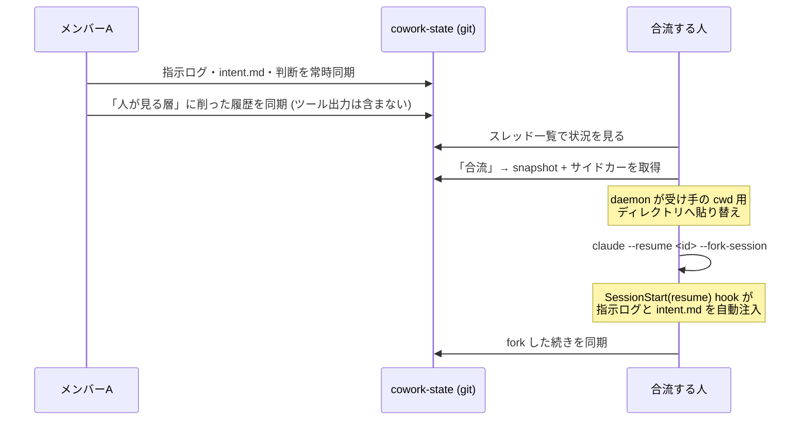
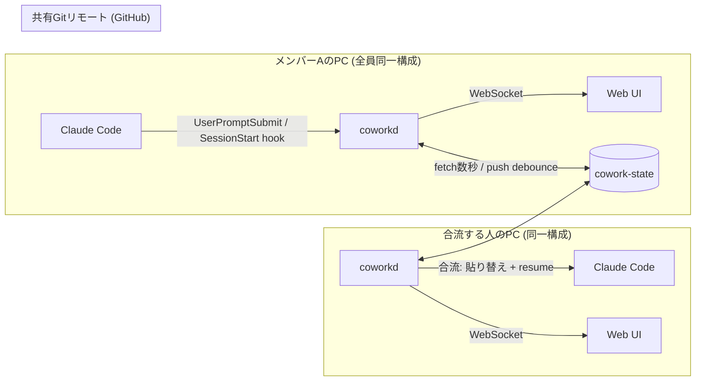

# 解決提案: 作業スレッドを共有して合流する開発基盤 (仮称: cowork)

issue.md への解決提案。

**改訂履歴**: 初稿(MGRが承認するレビューツール) → 独立4視点レビュー → review.md による妥当性検証 →
**要求の明確化と技術検証を受けて全面改訂**(本版)。
実現可能性は feasibility.md に実測記録あり。

**review.md の指摘の現況**(review.md は初稿へのレビューなので一部は古くなっている):

| review.md の指摘 | 本版での扱い |
|---|---|
| §2-A: L1承認という新しい待ち行列を追加している | **解消**。承認をゲートから外し確認マークにしたため、待ち行列が構造的に発生しない(§5.2) |
| §2-B: 比較表に案A+(GitHub標準)が欠けている | **反映**。§4で再評価し、自作範囲を3点に絞り込んだ |
| §2-D: 採用インセンティブが罰に寄っており順序が逆 | **反映**。Phase 1 を作業者便益に変更(§7)。「承認済みリンクのないPRはレビューしない」ルールは撤回 |
| §2-E: 最重要仮説が Phase 0 で検証されない | **反映**。Phase -1 を追加(§7)。ただし検証対象を「10行のL1で判断できるか」から「共有と合流が効くか」に変更 |
| §1: EASE 2026 の引用ずれ、PRサイズ+154%の出典 | **修正済**(§2の記述) |
| **承認者マトリクスへの批判(§3の一部)** | **失効**。マトリクス自体を廃止したため |

---

## 1. 何を作るのか

> **タスクごとに「作業スレッド」を共有し、誰でもそこに合流して続きを進められるようにする。**

- スレッドに入るのは **AIへの指示・判断・セッション履歴**。実装物ではなく**過程**が共有物になる
- 誰でも合流して、そのスレッドの文脈を引き継いだまま自分の Claude Code で続きを実行できる
- 役割を固定しない。MGRもメンバーも同じ構成・同じ操作。**承認する人／される人を作らない**
- 「承認」は通行許可(ゲート)ではなく、**自分がどこまで確認したかの印**として実装する

**対象者(確定)**: 全員が Claude Code と git チェックアウトを持つエンジニア。
非エンジニアの参加は考えない。したがって**閲覧専用モードや権限の場合分けは設計に入れない** —
全員が同一の構成を動かすことを前提にできるため、対称性が例外なく成立する。

これは「レビューを速くする道具」ではなく「**一緒に進める道具**」である。
レビューコストの低下は、一緒に進めた結果として得られる副産物と位置づける。

**そして、作る量は当初想定よりずっと少ない。** 技術検証の結果、必要な機能の大半は
既に出荷されている部品(Claude Code の公式機能・GitHub 標準機能・既存OSS)で満たせることが分かった。
本提案は「新しいツールを作る」より **「出荷済みの部品を組み立て、足りない薄い層だけを書く」** 提案である。

## 2. 課題の構造

「実装コストが激減したのに、検証コストは人間律速のまま」という非対称。外部データも裏付けている:

- AI高採用チームは PRマージ数 +98%、レビュー時間 +91%、PRサイズは75パーセンタイルで約2.6倍。
  律速の実体は**着手待ち(pickup time)** で、AI生成PRは着手まで 4.6〜5.3倍 待たされる (LinearB 2026)
- AI生成PRの受理率は **32.7%**(人間84.4%)。生成物の2/3は捨てられている (同上)
- 85%が「ボトルネックは書くことからレビュー・検証に移った」と回答 (GitLab 2026)
- AI生成PRの大半は人間のレビューを受けていない (EASE 2026)

手元の実測が、この非対称を最も端的に示している:

> review.md を作成したセッションは 111レコード・388KB。
> そこに含まれる**実質的な人間の指示は、117文字の1件だけ**だった。

**人間の意図は極小、AIの出力は膨大。**
レビューが辛いのは、この117文字を復元するために数百行の diff を読まされるからである。
**ならば117文字の側を共有すればいい** — これが本提案の中心にある。

| 認知負荷の源泉 | issue.md での現れ | 対応 |
|---|------|------|
| **事後性** — 判断後に逆推理させられる | 「初見で理解して妥当性を判断するのが非常にきつい」 | 過程を共有し、途中で合流する |
| **一括性** — 全粒度を一度に見せられる | 「PRのサイズも大きくなりやすい」 | 判断を粗い順に読む |
| **コード中心** — 意図が diff から見えない | 「事前の相談なども少なく」 | 指示と判断を第一級データにする |

## 3. 技術検証で確定したこと

詳細は feasibility.md。**3つの別々の問いに分けて答える必要がある。**

| 問い | 結論 |
|---|---|
| **① 複数人が同時に1セッションへ入る** | **不可能。回避策もない。** 公式が「forkせずに2ターミナルで再開すると両者のメッセージが1つのtranscriptに混ざる」と明記。ロックもマージもない=事故 |
| **② 他人のセッションを別マシンで後から引き継ぐ** | **可能**(実測で確認)。受け手のcwdに対応するディレクトリへ置けば `--resume` で完全な文脈が復元される。参照ファイルが無くても読める。ただし**非公式で脆い** |
| **③ 指示・判断の共有と精査と引き継ぎ** | **完全に可能。公式サポートが厚い。ここが本命** |

→ **「合流」は同時共同編集ではなく、fork による分岐として設計する**(排他制御は不要 — §8.2)。

主要な確定事項:

- **指示の取得は公式**: `UserPromptSubmit` hook が本文を渡す(実機のフィールド名は `prompt`。ドキュメントの `user_message` とは異なるので両対応が要る)
- **引き継ぎの自動化点も公式**: `SessionStart` の matcher に `resume` / `fork` があり、`additionalContext` で文脈を自動注入できる
- **「全員同じ構成」は解決済み**: private git リポジトリの plugin marketplace + `.claude/settings.json` で、skills/hooks/commands が全員へ配られる。サーバー不要・階層なし・GA機能
- **先行実装がある**: claude-git-sessions (ccgs) が orphan ブランチ `@ccgs/<name>` でこれを実装済み。ただし star 14 の早期段階で秘密情報のリダクション未実装。**参照実装として読む**
- **公式の代替経路は使えない**: Agent SDK の `SessionStore` は「別ホストからの resume」を公式サポートするが、
  **CLI からは差し込めない**(設定手段が存在せず、`--resume` は `~/.claude/projects/` のみを探索する)。
  使うにはチーム全員が対話TUIをやめて SDK 駆動に移行する必要があり、それは別物になる。
  → **合流は非公式な貼り替え方式に依存し続ける。「将来公式経路へ移行できる」という逃げ道はない**(§5.5でリスクを扱う)
- **Agent Teams は使えない**: teammate は全てAI。「Lead is fixed(移譲不可)」と公式明記で、**要求の非階層性に構造的に反する**
- **秘匿情報の自動除去は構造的に困難**: `PostToolUse` は実行後に発火するため生の値は既に書かれている。防御は「push時のスキャンでブロック」「秘密を読ませない権限設計」「本人が選んだものだけ共有」の三段構え

## 4. アプローチ比較 — 自作範囲はどこまで縮むか

review.md は「GitHub標準機能でほぼ実現でき、残差3つのために8〜12週かけるのは正当化されていない」と指摘した。
これは妥当だった。今回の要求追加と技術検証を踏まえて再評価する。

### 4.1 機能ごとの調達先

| 必要な機能 | 調達先 | 自作量 |
|---|---|---|
| 全員に同じ構成(skills/hooks/commands)を配る | **plugin marketplace (private git repo)** | **0** |
| 方針・判断のファイル | `docs/decisions/*.md` | 0 |
| 対称な M-of-N 承認ゲート | **GitHub ruleset の required approvals(CODEOWNERSを使わない)** | **0** |
| 承認後の変更検知 | Actions で content_hash | 数十行 |
| PRから「そのdiffを生んだ指示履歴」へ飛ぶ | **`claude --from-pr <PR番号>`** | 0 |
| 毎ターンの意図逸脱チェック | **`/goal`、または settings.json の Stop hook** | 小 |
| 意図を compaction から守る | **CLAUDE.md への固定**(再注入される) | 0 |
| 要求とコードの乖離検知 | **REQ-ID の引用規律 + grep の集合差分** | 小 |
| セッション共有の土台 | ccgs 参照(**公式経路は使えない**) | 中 |
| **指示ログの自動収集と共有** | **自作** | 小 |
| **合流(取得・貼り替え)** | **自作**(既製品が世界的に存在しない) | 中 |
| **スレッド一覧UI** | **自作** | 中 |

**残る自作は3つ**: 指示ログの共有 / 合流 / 一覧UI。
review.md 時点の「残差3つ」とは中身が入れ替わり、**いずれも新要求の中核そのもの**になった。

### 4.2 なぜ GitHub だけでは届かないか

GitHub は**成果物**を持つが**会話**を持たない。したがって構造的に不可能:

- 実行中の指示ストリーム(誰が今AIに何を頼んでいるか)
- スレッドへの途中合流(セッションはローカルにしか存在しない)
- 会話軌跡にもとづく意図ドリフト検知(会話が存在しない)

→ **判断**: 自作の根拠は新要求によって初めて成立した。
ただし review.md の「作る前に確かめる」原則は維持し、**Phase -1 で最も安い検証を先に通す**(§7)。

### 4.3 3案の比較

| 評価軸 | 案A+: GitHub標準のみ | 案B: Vibe Kanban フォーク | 案C': 既製部品+薄い自作 ★推奨 |
|--------|------------------|--------------------|--------------------|
| 判断の記録・承認・変更検知 | **◎** | ○ | ◎(案A+をそのまま使う) |
| 指示ログの共有 | △ 手動のみ | ✗ | ◎ |
| 途中合流 | ✗ | ✗ | ◎ |
| 意図ドリフト検知 | ✗ | ✗ | ○ |
| 初期コスト | 小(数日) | 中 | 中(段階的、Phase 1は2〜4週) |
| 保守コスト | 小 | 大(開発元が2026-04撤退) | **小〜中**(自作を3点に絞ったため) |

**推奨は案C'。ただし案A+ を土台として使い続ける。**
判断ファイル・承認ゲート・変更検知は最後まで GitHub に任せ、自作は GitHub に原理的に届かない3点に絞る。

## 5. 全体設計

### 5.1 中心概念: スレッド

タスク1件 = スレッド1本。

**「過程」と「成果」を別のリポジトリに置く。** 性質が違うため混ぜてはいけない(理由は下記)。

```
your-repo/                         # 【成果】コード・設計資料のリポジトリ
├── docs/cowork/0042-payment-refactor/
│   └── intent.md                  #   方針(10行)。粗い粒度の入り口 兼 ドリフト検知の基準
└── docs/decisions/<主題>.md        #   稀。同じ問いが2度目に立った時だけ作る(§8.4)

PR本文                             # 【決定】決めたこと + 採らなかった案(§8.4)

cowork-state/                      # 【過程】専用リポジトリ
└── threads/0042-payment-refactor/
    ├── thread.md                  #   Notionタスクへのポインタ + 実行時の状態(誰のAIが動いているか等)
    ├── instructions.jsonl         # ★ 誰がいつAIに何を指示したか(自動収集)
    ├── intent-log.jsonl           # ★ intent.md のスナップショット履歴。バッジ判定に使う(下記)
    ├── links.jsonl                #   どの変更がどのやりとりから生まれたか(自動)
    ├── receipts.jsonl             # ★ 確認の記録。union merge driver で自動マージ
    └── sessions/                  #   合流用。「人が見る層」だけに削った履歴(§8.1)
```

**★ が MVP-0 の範囲**(mvp0-spec.md)。`links.jsonl` と `sessions/` は後続フェーズ。

`intent-log.jsonl` が過程側にあるのは、**一覧UIが他人のコードリポジトリを読まずにバッジを判定できるようにするため**。
`intent.md` の正本はあくまでコード側(上書きで最新を保つ)で、こちらはスナップショットの時系列にすぎない。

| | 過程(cowork-state) | 成果(コードのリポジトリ) |
|---|---|---|
| 書かれ方 | **追記のみ**。時系列 | **上書き**。常に「いまのあるべき状態」 |
| 衝突 | **起きない**(誰の発言かで確定) | **起きる。解消して最新を保つ** |
| 古い内容 | 過去として残る | 書き換わって消える |

混ぜると、追記だけで済む記録に衝突解消が必要になり、最新を保つべき文書がログに埋もれる。

**方針と決定をコード側に置く副次的な効き目**: 方針を変えるときは実装も変わるので、
同一リポジトリなら**同じPRで両方を変えられる**。
「方針はそのままなのに実装だけ進んでいた」というズレが構造的に起きにくくなり、
これは §5.4 の意図ドリフト対策そのものになる。

**plan(計画)は過程側**。plan mode の出力はその時点の提案であってあるべき状態ではなく、
複数出ればどれが正かも決まらない。よって履歴として時系列に残し、
**残すと決めたものだけが `intent.md` / `decisions/` へ昇格する**(昇格は人が確定する)。

**共有するのは「人が見る層」だけ**(§8.1 で決定)。
人間が入力したテキストと、AIが人間に向けて話したテキスト(説明・提案・確認・計画)のみを残し、
ツール呼び出しとツール出力は同期しない。実測で全体の0.7%まで縮み、
**ファイル全文や秘密が入るツール出力を構造的に含まず、それでも `--resume` できる。**
当初想定していた「軽量な指示ログ + 重いスナップショット」の2層構成は、これにより1層に統合される。

**指示ログ (instructions.jsonl)** — 要求(3)の中核。`UserPromptSubmit` hook から自動収集:

```json
{"at":"2026-07-25T05:07Z","by":"takuto","session":"b83f7dba",
 "prompt":"issue.md を解決したいです。proposal.md が妥当か否かレビューしてください"}
```

実測どおり1セッション数件・数百字なので、常時同期しても負荷にならない。
**チームは「誰が・どんな言い方で・何を頼んだか」を、実装物を見る前に読める。**

**intent.md** — **方針とドリフト検知の基準を1枚に統合する。**
当初は「方針(why/what/やらないこと)」と「意図の宣言(Goal/Non-goals/スコープ/受入基準)」を
別ファイルにしていたが、内容がほぼ重複するため1枚にまとめた。
人が最初に読む10行であり、同時に意図ドリフト検知の基準にもなる。
**CLAUDE.md から参照させて compaction を生き残らせる**:

```
なぜ:       決済リファクタで二重課金の可能性を消す
何を:       src/payment の課金処理を冪等にする
やらないこと: UIの変更、決済プロバイダの差し替え
触る範囲:   src/payment/**, test/payment/**
完了条件:   REQ-101..104 を満たし、既存の決済テストが全て通る
```

判断の階層は **intent.md(方針) → decisions/(設計判断) → 個別の判断** となる。
issue.md の「粗い粒度から段階的に確認」はこの並びで満たす。

### 5.2 対称性をどう担保するか

要求(1)「MGRもメンバーもほとんど同じ構成」「明確な優劣をつけない」に対する設計:

| 初稿(承認ゲート型) | 本版(対称型) | 根拠 |
|---|---|---|
| 承認者マトリクス(low=ピア/high=MGR必須) | **廃止**。誰でも確認を記録できる | 階層を作るのは CODEOWNERS。required approvals は元から対称 |
| risk tier が承認権限を決める | risk tier は**表示と優先度だけ**。権限に結びつけない | |
| 方針が未承認なら着手できない | **廃止**。着手は誰も止めない | 待ち行列を作らないため(review.md §2-A) |
| MGRのプロンプトは共有対象外 | **MGRの指示も等しく共有される** | 一方向の可視性は監視構造になる |
| 承認は真偽値 | **段階的な語彙**にする | Linuxカーネルの Acked-by/Reviewed-by/Tested-by に倣う |

**確認の記録 (receipts)** — issue.md の「承認した結果をマークする」を、ゲートではなくマークとして実装:

```json
{"target":"your-repo:docs/cowork/0042/intent.md","content_hash":"ab12...","repo_commit":"9f3e...",
 "by":"takuto","kind":"understood-intent","note":"方針OK。認証まわりだけ後で見る"}
```

- `kind` は `read` / `understood-intent` / `ran` / `object` の対称的な動詞。
  **要求(4)の「意図が失われていないか」は `understood-intent` の有無として表現できる**
- 意味は「私はここまで確認した」。他人の作業を止める力は持たない
- 対象が変われば**自分の記録だけが outdated** になる(他人の記録は他人のもの)
- **待ち行列を作らない**。review.md §2-A が指摘した最大の欠陥は、承認をゲートから外したことで構造的に消える

**重要な設計上の禁止事項**: **「誰が見ていないか」を可視化してはならない。**
(**自分専用の未確認リストは対象外** — 他者に露出しないため。ただし receipts は共有リポジトリにあり
技術的には他人の未確認も復元できるので、規約で補う必要がある。decision-records.md §7.6)
共有 read receipt の先行事例が事実上存在しないのは、未読の可視化が監視・詰問の装置になるためである。
Gerrit の attention set が「今誰のターンか」だけを示し、権限体系から完全に分離されているのは
この罠を避けるための設計判断と読める。**本設計も「ターン」だけを可視化し、「未読」は出さない。**

品質は何で担保するのか、という問いには実証で答える。
CHI 2026 の実験では、**AIとのやり取りがピアに見えているだけで**、AI生成コードへの依存が有意に下がり、
適用前に理解する責任感が生まれた。**承認ゲートなしに、可視化だけで効く。**

### 5.3 合流 — 要求(2)(6)



- **排他制御(バトン)は置かない。誰でもいつでも着手できる**(§8.2)。
  同一セッションの同時進行は transcript を壊すが、**合流は必ず fork するので同じセッションには決してならない** —
  新しいIDが発行され、ファイルも別になる。したがって守るべきものが存在しない
- **唯一の規約: 合流するときは必ず fork する**(`--resume` 単独では行わない)。
  これだけでセッションの衝突は構造的に起こらなくなる。ロックではなく規約で解く
- **合流は fork なので元のスレッドは壊れない**。分岐して戻すのは git と同じ感覚
- 受け手のチェックアウト先が違ってもデーモンが貼り替えを吸収する
- **さらに軽い合流**: 履歴も渡さず、intent.md + 指示の一覧 + 現在地だけを読んで引き継ぐ。
  日常の引き継ぎはこちらで足りる可能性が高い。**Phase -1 で確かめるのはまさにここ**(§7)

要求(6)「他メンバーが入ってきた際にちゃんと引き継げる」は、`SessionStart` の `resume`/`fork` matcher で
**引き継ぎブリーフを自動注入する1点に集約**するのが最も筋が良い。

### 5.4 指示の精査と意図ドリフト — 要求(4)

**(a) 指示そのものの改善**
指示ログが溜まると「どういう頼み方が良い結果を生んだか」がチームの資産になる。
**コードではなく指示にコメントできる**のが差別化点。
なお再利用される定型指示は `.claude/skills/` `.claude/commands/` にファイル化すれば、
**PRレビューがそのままプロンプトレビューになる**(履歴・blame・差分・議論が無料で付く)。

**(b) 意図のドリフト検知 — 3層で、上から順に効かせる**

| 層 | 手段 | 性質 |
|---|---|---|
| **1. 落とさない (最優先)** | intent.md を CLAUDE.md から参照させる。**Skill には置かない**(compact後に再注入されないため) | 予防 |
| **2. 毎ターン照合** | `/goal`、または settings.json の Stop hook。**リポジトリにコミットすれば全員に同じチェックが走る = 承認者を作らずに済む** | 自動・継続 |
| **3. 突き合わせ** | REQ-ID の集合差分(spec に無いIDがコードにある=捏造、あるIDが無い=取りこぼし)。**grep だけで決定的に判定でき、CIで落とせる** | 決定的 |

**なぜこの順序か**: Governance Decay 論文の内訳が決定的で、
**要約後も制約が残ったケースの違反率は0%、要約で落ちたケースは38%**。
つまり主因は「モデルの物忘れ」ではなく「compaction による物理的削除」であり、
**検知より先に「そもそも落とさない配置」が効く。**

補助として、`getSessionMessages()`(compaction後=AIが見ている履歴)と生ログ(compaction前)の差分を取ると、
**「当初の指示のうち、いま文脈から消えているもの」が一覧できる**。`PreCompact` hook は圧縮を block できるので、
重要な意図が落ちる直前に警告も出せる。

REQ-ID 方式を推す理由は精度だけではない。traceSDD の実証で検出率86〜88%・偽陽性0%と数字が良いうえ、
**機械が機械的に落とすので「人が人を指摘する」構図にならず、要求(1)の非階層性と整合する。**

### 5.5 アーキテクチャ

真実は git、ローカルデーモンは収集・配信・合流に徹する。**全員が同じ構成を動かす。**



**coworkd の責務**:

1. **Capture** — `UserPromptSubmit` で指示、`PreToolUse(ExitPlanMode)` で計画。**公式インターフェースのみ**。
   JSONL 直接パースは最小限に閉じ込める(公式が「内部仕様でリリースごとに壊れうる」と明言)
2. **Sync** — `receipts.jsonl` は `.gitattributes` の union merge driver で自動マージ。
   fetch は数秒、push は debounce。競合は退避ブランチへ隔離し**同期自体は止めない**。最終同期時刻を常時表示
3. **Join** — 「人が見る層」に削った履歴を受け手の cwd 用ディレクトリへ貼り替え、`--resume --fork-session` を起動。
   ツール記録を落としているのでサイドカー(`<session-id>/` 配下)の同梱も不要になる
4. **Serve** — Web UI をローカル配信(スレッド一覧・指示ログ・確認状況・稼働中のAI表示)
5. **Guard** — push 前の secret スキャン。**これは任意機能ではなく必須経路**

配布は plugin marketplace(private git repo)経由。**cowork 自身もこの仕組みで配る。**

**承知の上で負うリスク**: Join(責務3)だけは非公式な機構に依存する。
JSONL の行フォーマットは公式が「内部仕様でリリースごとに壊れうる」と明言しており、
公式のセッション共有要望も "not planned" でクローズされている
(= Anthropic にこの挙動を維持する義務がない)。SessionStore という公式経路は CLI からは使えない。

緩和は3点:
1. **Join を薄く隔離する** — 壊れてもそこだけ直せる形にし、他の責務を巻き込まない
2. **他の責務は公式 hooks のみに依存させる** — Join が壊れても要求(3)(4)(5)は生き残る
3. **Phase -1 でそもそも重い合流が要るのかを先に確かめる**(要らなければリスクごと消える)

### 5.6 共有境界とセキュリティ

**2つの懸念を分けて扱う。片方の緩和がもう片方を巻き込まないようにする。**

| 懸念 | 扱い |
|---|---|
| **監視感(心理的安全性)** | **対称性で大きく解消する**。MGRの指示も同じように見える。加えて決定的な軸は「共有が本人起点で選択的(author-initiated)か、自動で網羅的(auto-capture)か」— 前者は知識共有、後者は監視として着地する |
| **機密漏洩** | **対称性では一切解決しない。** transcript にはファイル全文・絶対パスが平文で入る(調査では1つの tool_result に15KB超のソース全文)。git に入れば履歴に永久に残る。自動リダクションは構造的に困難 |

**§8.1 の決定(「人が見る層」に絞る)が、この機密問題を大きく変えた。**
ツール出力は同期対象から**構造的に外れる** — 実測で全体の20.7%を占め、
ファイル全文・コマンド出力・絶対パスが入っていた部分がまるごと消える。
リダクション(除去)ではなく**そもそも収集しない**ので、「後付けが効かない」という難点も回避できる。

ただしこれで安全になったわけではない。**残る経路は人間の言葉そのもの** —
プロンプトに貼り付けたトークン、顧客名、障害の詳細などは依然として通る。したがって:
**push時のスキャンでブロック / 秘密を読ませない権限設計 / セッション単位の共有オプトアウト** は維持する。

**「人が見る層」の自動共有は、この原則に対する意図的な例外である。** 上の軸に厳密に従えば
自動収集・常時同期は auto-capture であり監視側に倒れる。それでも例外にする理由は3つ:

1. **要求(3)そのもの**が「他の人がどんな指示を出していたかを連携したい」である
2. **完全に対称**である — MGRの発話も同じ粒度で共有される。一方向の可視性を作らない
3. **ツール出力を含まない**ため、漏洩面が桁違いに小さい(§8.1)

例外に伴う手当て: **セッション単位の共有オプトアウト**を用意し、
**共有層も push 時のスキャン対象に含める**(「短いから安全」ではない)。
そして**「人事評価には使わない」の明示**(§8-5で決定済)は、この例外を成立させる前提条件である。

**もう1つの設計入力**: 「階層を作らない」は「全員がホストと同じ実行権限を持つ」とセットになる。
Cursor・Claude Code Channels・Slack統合の3つが独立に同じ警告を出している
(参加者はオーナーの資格情報と承認権限を継承する)。
**本設計は「自分の環境に取り込んで自分の権限で動かす」合流モデルなのでこの問題を回避している。**
他人のPCのエージェントを遠隔操作する方式を採らないのは、この理由による。

### 5.7 作らないもの

| 作らないもの | 理由・委譲先 |
|------|--------|
| 判断ファイル・承認ゲート・タスクボード | **案A+(GitHub Projects / required approvals / Actions)に任せる** |
| コードのバグ検出 | `/code-review`、PR-Agent |
| M-of-N の対称承認ゲート | **GitHub の required approvals(CODEOWNERS不使用)で既に対称** |
| 同時共同編集(キーストローク級) | **技術的に不可能**。fork による分岐で要求を満たす |
| 他人のPCのエージェントの遠隔操作 | 権限継承の危険・不在時の停止。合流は「自分の環境に取り込む」 |
| Agent Teams の利用 | 「Lead is fixed」で構造的に非階層性に反する |
| 未読の可視化 | 監視装置になる。ターンのみ可視化する |
| stacked PR、worktree管理 | git-spice、cmux/Conductor を併用 |

## 6. issue.md の要求との対応

| issue.md の要求 | 本版 | 備考 |
|---|---|---|
| レビューコストを下げたい | △ 未証明 | Phase -1 で検証。ただし**新しい待ち行列は作らなくなった** |
| 認知負荷が低い状態で方針を理解 | ○ | intent.md(10行)+ 指示ログ。「117文字の側を読む」 |
| 重要な部分は強度高く、低い領域は低コストで | **(a)○ / (b)△** | (a) 読む深さ = 3階層 + 掘らない自由。(b) 注意の配分 = バッジ2軸 + 各自のレンズで既定を絞る。**未検証・強制力なし**(decision-records.md §7) |
| 判断・指示を**即時に**共有しFBを受ける | **◎** | 指示ログは常時同期。初稿の「publish後のみ」から改善 |
| ローカルファイルを操作する体験 | ○ | Markdown + git |
| **他メンバーの成果物をLLMで修正・指示** | **◎** | 初稿ではスコープ外。合流(§5.3)で正面から満たす |
| 過程からこまめに共有・合意 | ○ | |
| 判断・選択の記録と妥当性確認 | ○ | |
| 粗→細の段階的確認 | ○ | |
| レビュー依頼なしでシームレスに | ◎ | 承認をゲートから外し、確認を状態にした |
| 作業者を個人に固定しない | ◎ | 合流。**誰でもいつでも着手でき、順番待ちも権限もない** |
| 承認のマーク | ○ | **ゲートではなくマーク**。段階的な語彙 |
| 承認後の変更検知 | ◎ | 3軸(判断変更/実装先行/意図ドリフト) |
| cmux風サイドバー一覧 | ○ | |
| 誰のAIが対応中か | ○ | heartbeat。**表示のみでロックはしない** |
| クラウド不要 | ○ | |
| 高速同期・最高の体験性 | △ | fetch数秒 + push debounce。§8-2 |

## 7. 段階導入

「作る前に確かめる」原則に従い、**最も安い検証を最初に置く**。

| Phase | 内容 | ゲート / 完了条件 | 目安 |
|-------|------|--------------|------|
| **-1. 合流の予行演習**<br>(ツール不要・コスト0) | 次の2〜3タスクで手動で試す。①作業者が自分の指示履歴(数行)+ Goal/Non-goals を共有ドキュメントに貼る ②別の人がそれだけを読んで合流し、続きを自分の Claude Code で進める ③引き継げたか・何を追加で聞く必要があったかを記録<br>→ **手順・テンプレート・記録シートは phase-minus-1.md にあり、そのまま実行できる** | **下記のとおり、結果の解釈が反転する点に注意** | 1週 |
| **0. 出荷済み部品だけで運用を立ち上げる** | plugin marketplace で全員に同じ hooks/skills を配る。intent.md(方針10行)+ CLAUDE.md 参照、GitHub required approvals(CODEOWNERS不使用)、`/goal` の試用。**ベースライン計測**とデータ取り扱いの合意 | 運用が回ること。**ここで足りていれば自作しない** — それが最大の節約 | 2〜3週 |
| **1. 指示ログの共有** | coworkd の Capture + Sync + 一覧UI。**作業者の便益を先に出す**: 指示ログが次セッションに自動注入され指示が短くなる、翌日の再開が速い、引き継ぎブリーフが自動生成される | 「書かされる」ではなく「使うと楽」で自走すること | 2〜4週 |
| **2. 合流** | 「人が見る層」への削り込み・取得・貼り替え、稼働中表示、secret スキャン | 実際に複数人が1スレッドを進められること | +2〜3週 |
| **3. 意図ドリフト検知** | Stop hook の共通化、REQ-ID の集合差分をCIへ、compaction差分の可視化、指示へのコメント | | +2〜3週 |

### Phase -1 の結果の読み方 — 成功は「Phase 2 を作らない理由」になる

直感に反するので明示しておく。

| Phase -1 の結果 | 意味 | 次の判断 |
|---|---|---|
| **指示ログ + Goal/Non-goals だけで引き継げた** | **履歴を渡さない合流(§5.3)で足りている**。履歴の貼り替え機構そのものが不要 | **Phase 2 を延期または中止する。** 自作は「指示ログ + 一覧UI」の2点に縮む。**非公式機構への依存というリスクごと消える** |
| 引き継げたが何度も質問が必要だった | 足りなかった情報が特定できる | その情報を intent.md / 引き継ぎブリーフの項目に足す。まだ Phase 2 は不要 |
| セッションの中身を見ないと無理だった | **重い合流に価値がある** | Phase 2 に進む。§5.5 のリスクを承知で負う |

**つまり Phase -1 の成功は「先へ進む許可」ではなく「作らずに済む証拠」でありうる。**
最大の自作部分(Join)を、着手前に1週間・コスト0で不要と判定できる可能性がある。

**計測指標**: pickup time / レビュー1件あたり所要時間 / 捨てPR率 / **作業者の追加負担(目標1日10分以内)**。
**「未確認の割合」は測らない**(§5.2の禁止事項)。代わりに合流回数・引き継ぎ成功率を見る。

撤退コストは低い。データは Markdown + JSONL + git 履歴なので、止めても記録は資産として残る。

## 8. 設計判断 — 決定事項

| # | 論点 | 決定 |
|---|---|---|
| 1 | 参加者の範囲 | **全員が Claude Code と git チェックアウトを持つエンジニア。** 非エンジニアは考えない → 閲覧専用モード・権限の場合分けは不要 |
| 2 | 同期の体感速度 | **fetch数秒 + push debounce で開始。** 不足を感じたら再検討 |
| 3 | 置き場 | **タスク=Notion / 過程=`cowork-state` / 成果物=コードのリポジトリ / 決定=PR本文**(§5.1、decision-records.md)。アクセス権はコードのリポジトリと同等以上に絞る |
| 4 | 共有する範囲 | **「人が見る層」に絞る**(下記 §8.1)。ただし**承認済みplan(ExitPlanModeのtool_result)は例外的に含める** |
| 5 | データ取り扱い | **人事評価には使わない。** Phase 0 前にチームへ明示する |
| 6 | 排他制御(バトン) | **置かない。誰でもいつでも着手できる**(下記 §8.2) |
| 7 | 自作 vs 公式追随 | **原則は薄く保つ。必要なら作る。** 独自フォーマットに深入りしない |
| 8 | 非公式機構への依存 | **許容する。壊れたらその時に対処する** → §5.5 の緩和策(Join を薄く隔離し、他機能を巻き込まない)は維持する |
| 9 | 同期先(GitHub か LAN か) | **未決。§8.3 で整理**(アーキテクチャではなくデータ分類の問題として扱う) |

### 8.1 共有する範囲 — 「人が見る層」に絞る 【決定】

「全部同期は重い / 都度手動選択は辛い / 毎回要約させるのはトークンがきつい」という三すくみに対し、
**共有対象を「人間が入力したテキスト」と「AIが人間に向けて話したテキスト(説明・提案・確認・計画)」に限定する。**
ツール呼び出しとツール出力は共有しない。

実測で裏を取った(feasibility.md):

| 観点 | 結果 |
|---|---|
| 分量 | 中身ベースで**全体の0.7%**。ファイルとしても約1/4に縮む |
| 秘匿情報 | **ツール出力(全体の20.7%、ファイル全文や秘密の入り口)を構造的に含まない** |
| トークン消費 | **ゼロ**。要約させないため |
| 手動選択 | **不要**。決定的なフィルタで機械的に抽出できる |
| `--resume` できるか | **できた**(実測)。削った履歴からでも文脈を保って再開できる |

**残るもの = 筋書き**(何を頼み、AIが何を提案・説明し、どう合意したか)。
**失われるもの = 証拠**(読んだファイルの中身、コマンド出力)。
合流先はリポジトリを持っているので、必要なら読み直せばよい。実用上の劣化は小さい。

これにより **§5.1 の「軽量な指示ログ」と「重いスナップショット」の2層構成は1層に統合できる。**
保持方針・Git LFS の要否といった論点も、量が2桁減るためほぼ消える。

### 8.2 排他制御(バトン)は置かない 【決定】

当初はバトン(操縦権)を必須としていたが、**再検証の結果これは不要だった。** 撤回する。

**なぜ必要に見えたか**: 公式ドキュメントが「fork せずに同じセッションを2つのターミナルで再開すると、
両方のメッセージが1つの transcript に混ざる」と警告しているため、排他が要ると考えた。

**なぜ不要か**: **合流は必ず fork するので、そもそも「同じセッション」には決してならない。**
fork は新しいIDを発行し、ファイルも各自のマシン上で別になる。
つまり守るべき対象が存在しない。**セッション単位の排他と、タスク単位の交通整理を混同していた。**

したがって設計は次のようになる:

- **誰でも、いつでも、好きなタスクに着手できる。** 順番待ちも、権限も、明け渡しも要らない
- **規約はひとつだけ: 合流時は必ず fork する**(ロックではなく規約で解く)
- ロックが無いことは対称性とも整合する。バトンは「持っている間だけ特権を持つ」小さな権限体系であり、
  「明確な優劣をつけない」という方針と本質的に相性が悪かった

**では衝突はどうなるのか**(§8.2.1)。

#### 8.2.1 実際に衝突しうるもの、と対処

| 衝突しうるもの | 起きるか | 対処 |
|---|---|---|
| セッション履歴 | **起きない** | 合流時に必ず fork するため、別ID・別ファイルになる |
| cowork-state の記録(指示ログ・確認) | 起きるが自動解決 | ユーザー別シャード + `.gitattributes` の union merge driver |
| **同じブランチのコード** | **起きる** | **通常の git 作業**。下記 |
| 同じ作業の重複 | 起きる | **防止しない。見えるようにするだけ** |

**コードの衝突**が唯一の実質的な論点になる。AIが書くと差分が大きいぶん衝突も痛いが、
これはツールで止める問題ではなく**チームが既にできる git 作業**である。運用としてはこうする:

- **既定は同じブランチで作業してよい**(協働しているので、そのほうが自然)
- **同時にAIを走らせるときだけブランチを分ける。** セッションを fork したなら、ブランチも fork する。
  マージは通常の git 操作になる(「合流は git と同じ感覚」という設計思想と一貫する)
- その判断ができるように、**「今このスレッドで誰のAIが動いているか」を一覧に表示する** —
  これは issue.md が元から求めている表示であり、ロックではない

**機械が止めるのではなく、人が見て決める。** これは §5.2 の「強制ではなく可視性で効かせる」と同じ原則である。

なお fork は履歴を複製するため、3人が合流すれば4部の履歴ができる。
§8.1 のフィルタにより1部あたり100KB程度なので実用上は問題にならない
(フィルタなしなら深刻だった。ここでも §8.1 の決定が効いている)。

### 8.3 同期先 — GitHub にアップロードして大丈夫か 【未決】

**これはアーキテクチャの問題ではない。** 設計は git ベースなので、
**同期先の変更は remote の設定変更であって、他は何も変わらない。**
GitHub → LAN 上のベアリポジトリ / 社内 Gitea への切り替えは、後からでもコストがほぼゼロで行える。
したがって「今すぐ正解を決める」必要はなく、**データ分類の問題として判断すればよい。**

判断材料:

| 論点 | 内容 |
|---|---|
| **何が上がるのか** | §8.1 の決定により、上がるのは**人間の言葉とAIの説明文だけ**。ファイル本文もコマンド出力も含まない。当初想定より露出面は大幅に小さい |
| **コードは既にどこにあるか** | ソースが既に GitHub(private)にあるなら、そのコードについての指示は**コードより機密性が低い可能性が高い**。逆にソースを社外に置いていないなら、指示も置くべきではない |
| **指示に固有のリスク** | プロンプトにはコードに無いものが混ざりうる(顧客名、障害の詳細、貼り付けた認証情報)。→ push 時のスキャンは §8.1 を採用しても外さない |
| **LAN 側のコスト** | ホストマシンの可用性、バックアップ、リモートワーク時の到達性。Tailscale 等のオーバーレイで「LAN」を拠点外へ広げる選択肢もある |

**推奨**: ソースが既に GitHub private にあるなら、**同じ組織・同じメンバー範囲で専用リポジトリを作り、
§8.1 のフィルタ + push時スキャンを付けて GitHub で開始する。** 露出面が「人の言葉」に限られる以上、
コードより緩い扱いにはならない。
社内規程やお客様との契約で制約があるなら、**LAN 上にベアリポジトリを1つ置くだけで設計は一切変わらない。**

**Phase 0 で決める。** それまでは判断を保留してよい(Phase -1 は共有ドキュメント上の手作業なので影響を受けない)。

### 8.4 意思決定の記録と plan の扱い 【決定】

8視点(提案5+批判3)で検討した結果を **decision-records.md** にまとめた。要点:

- **plan は独立保存しない**(既に過程側にある)。ただし**承認済みplanはtool_result側にあるので共有層に含める**
- **決定と採らなかった案は PR本文**に置く(レビュアーが必ず見る唯一の場所。空欄でもマージ可)
- `docs/decisions/<主題>.md` は**「同じ問いが2度目に立った時」だけ**作る(需要駆動)
- 紐付けの主キーは**スレッドID**。ID行を各コミットとPR本文の両方に書き、**grepで取り出す**
  (squashメッセージ設定は両方ありうるため。実測で両対応を確認)
- **タスク管理はしない**。一覧・優先度・担当は Notion が持つ

### 8.5 レビューのトリアージ 【決定】

issue.md L12 の後半(注意の配分)への答え。詳細は **decision-records.md §7**。

- **共有するのはスレッドの属性(バッジ)だけ。順位は共有しない。並びは各自のクライアントが決める**
  (共有順位は「上位=誰かが片付けるべきもの」となり、消したはずの待ち行列が並び順として復活するため)
- **主機構は並べ替えではなく足切り。** 既定表示は「自分が未確認 × バッジ付き」。バッジなしは畳む
- **バッジは2軸(変更の性質 / 場の状態)。合成スコアにしない。** 必ず根拠へ展開できること
- **「このスレッドは誰の確認も無い」は出さない**(前版から撤回。小規模チームでは個人の名指しと同義になる)
- **他人の未確認は技術的には復元可能。** 防ぐのではなく「集計・表示する道具を作らない」規約で運用する

## 9. 参考資料

- LinearB 2026 Benchmarks — https://linearb.io/resources/software-engineering-benchmarks-report
- GitLab 2026 AI Accountability Report — https://www.infoq.com/news/2026/06/ai-coding-outpaces-governance/
- These Aren't the Reviews You're Looking For (EASE 2026) — https://arxiv.org/abs/2605.02273
- Claude Code hooks — https://code.claude.com/docs/en/hooks
- Claude Code sessions — https://code.claude.com/docs/en/sessions
- Agent SDK: Session Storage — https://code.claude.com/docs/en/agent-sdk/session-storage
- Agent Teams(不適合の根拠) — https://code.claude.com/docs/en/agent-teams
- claude-git-sessions (参照実装) — https://github.com/ingram-technologies/claude-git-sessions
- claude-code-transcripts — https://simonwillison.net/2025/Dec/25/claude-code-transcripts/
- git-appraise (承認のgit格納) — https://github.com/google/git-appraise
- Gerrit attention set / ラベル失効 — https://gerrit-review.googlesource.com/Documentation/config-labels.html
- cmux (サイドバーUXの参照元) — https://github.com/manaflow-ai/cmux
