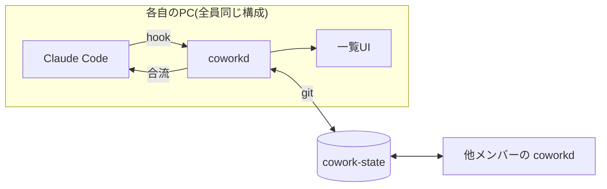

# cowork — 解決案(最新版)

構成を確認するための要約。検討の経緯・レビュー履歴は proposal.md / feasibility.md / review.md にある。

---

## 1行で

> **タスクごとに「作業スレッド」を共有し、誰でもいつでも合流して続きを進められるようにする。**

レビューを速くする道具ではなく、**一緒に進める道具**。レビューコストの低下はその結果として得る。

## なぜこれで効くのか

手元での実測: あるセッションは111レコード・388KBあったが、**人間が出した指示は117文字の1件だけ**だった。

**人間の意図は極小、AIの出力は膨大。** レビューが辛いのは、この117文字を復元するために
数百行の diff を読まされるから。**だから、この117文字を復元できる層を共有する。**

---

## 使うとどうなるか

### A. 作業を始める

1. スレッドを作り、`intent.md` に方針を10行書く(なぜ / 何を / やらないこと / 触る範囲 / 完了条件)
2. あとは普段どおり Claude Code で作業する
3. **AIへの指示は自動で共有される**(hook が拾うので、書き写す手間はない)

### B. 他の人の作業を見る

- 一覧に全スレッドが並ぶ。**誰が何を頼んでいるか、いまAIが動いているか**が見える
- 開くと**まず方針10行が見える**(コード側から読み込んで表示する)。必要なら決定の記録へ掘る。掘らない自由がある

### C. 合流する

- 「合流」すると、**そのスレッドの会話を引き継いだ状態で自分の Claude Code が立ち上がる**
- **誰でも、いつでも。** 順番待ちも権限も明け渡しも要らない
- 分岐して進むので**元のスレッドは壊れない**
- 同時にAIを走らせるとコードが衝突しうる。そのときはブランチを分けて通常どおりマージする。
  止めるのはツールではなく、「いま誰か動かしている」が見えることで人が判断する

### D. 確認する

- 「**ここまで確認した**」を記録する。深さは `読んだ` / `意図を理解した` / `動かした` の3段階。
  これとは別に「異議あり」を付けられる(付けても作業は止まらない)
- 確認の対象は**方針・決定・コード**(いずれもコードのリポジトリ側にある)。記録だけが cowork-state に残る
- 後で**対象が変われば、自分の記録だけが外れる** → 再確認の対象として出る
- **誰かを止める力はない。** cowork の側で承認待ちは発生しない

### E. 重く見るものを絞る

- スレッドには**バッジ**が付く。`risk:決済` のような**変更の性質**と、`object` のような**場の状態**の2種類。
  合成して点数にはしない。**バッジは必ず根拠(該当パス・diff・異議の中身)へ展開できる**
- **一覧の既定は「自分が未確認 × バッジ付き」だけ。** バッジが無いものは畳む(消えはしない)
- **順位は共有しない。** 並びは各自のクライアントが決めるので、全員の先頭が互いに違う。
  共通の「重要度順」を置くと、上位が「誰かが片付けるべきもの」になって待ち行列が戻る
- 読む深さの「掘らない自由」に対応する、見る対象の「**見ない自由**」

---

## 仕組み

### どこに何を置くか — 「過程」と「成果」を分ける

**cowork-state は過程だけを持つ。成果物はコードのリポジトリに置く。**

```
Notion                                 # 【タスク】一覧・優先度・担当。cowork は関与しない
  └ タスク「決済リファクタ」            #   ↕ URLで疎結合

your-repo/                             # 【成果】コード・設計資料のリポジトリ
├── src/ ...
├── docs/cowork/0042-payment-refactor/
│   └── intent.md                      #   方針10行。最初に読む1枚
└── docs/decisions/<主題>.md           #   稀。同じ問いが2度目に立った時だけ作る(後述)

PR本文                                 # 【決定】決めたこと + 採らなかった案。squashでコミットに残る

cowork-state/                          # 【過程】専用リポジトリ
└── threads/0042-payment-refactor/
    ├── thread.md                      #   Notionタスクへのポインタ + 実行時の状態
    ├── instructions.jsonl             #   誰がいつAIに何を指示したか(自動収集)
    ├── intent-log.jsonl               #   方針の版の履歴。バッジ判定に使う
    ├── links.jsonl                    #   どの変更がどのやりとりから生まれたか(自動)
    ├── receipts.jsonl                 #   「ここまで確認した」の記録
    └── sessions/                      #   合流用に削った会話履歴
```

**タスクの箱は Notion。cowork はタスク管理をしない。**
一覧・優先度・担当は Notion が持ち、cowork は1タスクに対応する「作業の過程」だけを扱う。
連携は疎結合(URLを1つ持つだけ)。


**分ける理由は、この2つが性質からして別物だから。**

| | 過程(cowork-state) | 成果(コードのリポジトリ) |
|---|---|---|
| 中身 | 指示・会話・確認の記録 | 方針・決定・設計資料・コード |
| 書かれ方 | **追記のみ**。時系列で積まれる | **上書き**。常に「いまのあるべき状態」 |
| 衝突 | **起きない**(誰の発言かで確定する) | **起きる。解消して最新を保つ** |
| 消えるか | 消さない。過去は過去のまま残る | 古くなったものは書き換わる |

これを1つのリポジトリに混ぜると、追記だけで済むはずの記録に衝突解消が必要になり、
逆に最新を保つべき文書が時系列のログに埋もれる。

**方針と決定をコード側に置くことには、もう一つ効き目がある。**
方針を変えるときは実装も変わる。同じリポジトリにあれば**同じPRで両方を変えられる**ので、
「方針はそのままなのに実装だけ進んでいた」というズレが構造的に起きにくくなる。
これは我々が防ごうとしている意図ドリフトそのものへの対策になる。

### plan(計画)はどちら側か → 過程

plan mode が出す計画は「その時点の提案」であって、あるべき状態ではない。
複数回出れば、どれが正なのかも決まらない。よって**計画は履歴として時系列に残す**。

そのうえで、**残すと決めたものだけが `intent.md` や `decisions/` に昇格する**。
昇格は人が決める(AIが下書きを出し、人が確定する)。
「起きたこと」と「残すと決めたこと」を分けることで、成果物が提案で膨らむのを防ぐ。

### 決定と「採らなかった案」はどこに残すか

**採らなかった案は commit を1つも生まない。** つまり「どの変更がどのやりとりから生まれたか」の
紐付けをいくら強化しても、**まさに残したいものには構造的に届かない**。だから最小限の記録が要る。

| 何を | どこに | 誰が |
|---|---|---|
| 決めたこと + **採らなかった案** | **PR本文**(squash でコミットメッセージに残る) | AI下書き → 人は yes/no か消すだけ。**空欄でもマージできる** |
| 繰り返し聞かれる決定 | `docs/decisions/<主題>.md` | 人。**同じ問いが2度目に立った時だけ**作る |

**PR本文に置くのは、レビュアーが必ず見る唯一の場所だから。**
別ファイルに置くとリンクを踏まない限り読まれず、判断材料がPRの外にあっては目的に効かない。
人が作るファイルも1つも増えない。

**下書きは実際のやりとりを引用する。要約させない。**
理由がログに無ければ「(理由未記録)」と書く。要約させると、
人が「B」と一言答えただけなのにAIが「Aは性能懸念のため却下」と書き、
**存在しなかった理由が記録として定着する**。

`docs/decisions/` を「決めた時」ではなく**「2度目に聞かれた時」に作る**のがこの設計の要点。
存在するものが全て「実際に誰かが欲しがったもの」になるので、
何を1件と数えるかの粒度問題も、件数の少なさが重要度なのか記録漏れなのかの曖昧さも消える。

**変更とやりとりの紐付け**は、スレッドIDの1行を**各コミットのメッセージとPR本文の両方**に書き、
**grep で取り出す**。squash の設定(PR本文を使う / 元コミットを連結する)はリポジトリごとに違うが、
両方に書いておけばどちらの設定でも1本は生き残る(実測確認済み)。

### 共有しないもの ← ここが要

**ツール呼び出しとツール出力(ファイル全文・コマンド出力)は同期しない。**
共有するのは **人間が入力したテキスト** と **AIが人間に向けて話したテキスト**(説明・提案・確認・計画)だけ。

実測では、共有する層は全体の **0.7%**。同期から外れるツール出力は全体の **20.7%** を占め、
認証情報などが混ざりうるのはこの外れる側である。

**例外**: 承認済みの plan だけはツール出力側に入っているので、これは共有層に含める
(除くとユーザーが編集した最終版の計画が失われるため)。

要約しないので**追加のトークン消費はない**。機械的に抽出するので**手動選択も不要**。
そして**削った履歴からでも合流できる**ことは実測で確認済み。
残るのは「筋書き」、失われるのは「証拠」(必要なら合流先でファイルを読み直せばよい)。

### 意図が途中で失われないようにする

3層。**上から順に効かせる**(検知より先に「そもそも落とさない」)。

| 層 | 手段 |
|---|---|
| 1. 落とさない | `intent.md` を `CLAUDE.md` から参照させる。会話が要約されても残る |
| 2. 毎ターン照合 | Stop hook。設定をリポジトリで共有するので**全員に同じチェックが走る** |
| 3. 突き合わせ | 方針と実装のズレを grep で機械的に判定し、CI で落とす |

3 は**機械が機械的に落とすので、人が人を指摘する構図にならない**。

### 全体構成



`coworkd` は各自のPCで動く。やることは4つ — **指示を拾う / git で同期する / 一覧を出す / 合流させる**。
このうち同期は git に任せるので、**自作するのは「指示を拾う・一覧を出す・合流させる」の3つ**。
配布は private リポジトリの plugin marketplace 経由(全員に同じ hooks と設定が配られる)。

---

## 設計の原則 — 誰も特権を持たない

| 項目 | 方針 |
|---|---|
| 承認 | **ゲートにしない。** 誰でも「確認した」を記録できるだけ |
| 着手 | **排他制御を置かない。** 誰でもいつでも好きなタスクに着手できる |
| 指示の共有 | 役割によらず**全員の指示が同じように共有される** |
| 未読 | **表示しない**(監視の装置になるため)。出すのは「いま誰が動かしているか」だけ |
| 構成 | 全員同一。役割による場合分けを持たない |

---

## 作らないもの

| 機能 | 任せる先 |
|---|---|
| タスクの一覧・優先度・担当 | **Notion** |
| 承認フロー | GitHub(required approvals) |
| コードのバグ検出 | `/code-review`、PR-Agent |
| 同一セッションの同時共同編集 | **Claude Code では技術的に不可能。** 合流(分岐)で要求を満たす |
| 他人のPCのエージェントの遠隔操作 | 合流は「自分の環境に取り込んで自分の権限で動かす」 |
| ロック機構 | 不要。合流が必ず分岐なので、衝突はマージで解ける |

---

## 前提と未決

| | |
|---|---|
| 対象者 | Claude Code と git を使うエンジニアのみ |
| 置き場 | **タスク**は Notion、**過程**は `cowork-state`、**成果物**はコードのリポジトリ、**決定**はPR本文 |
| データの扱い | **人事評価には使わない。他人の未確認を集計・表示する道具も作らない** |
| **未決** | 同期先を GitHub にするか LAN に置くか |

未決の1点は急がない。設計は git ベースなので **remote の設定を変えるだけ**で、後から移せる。

---

## 次の一歩

**Phase -1(1週間・ツール不要・コスト0)** — 手順は phase-minus-1.md にある。

次の2〜3タスクで、作業者が方針10行と指示履歴を共有ドキュメントに貼り、
別の人がそれだけを読んで**引き継げるか**を試す。

**注意**: ここで「メモだけで引き継げた」となったら、それは**合流機能を作らずに済む証拠**。
合流は自作3点のうち最も重く、唯一 Claude Code の非公式な挙動に依存する部分でもある。
成功は「先へ進む許可」ではなく「作らなくてよい」を意味しうる。
